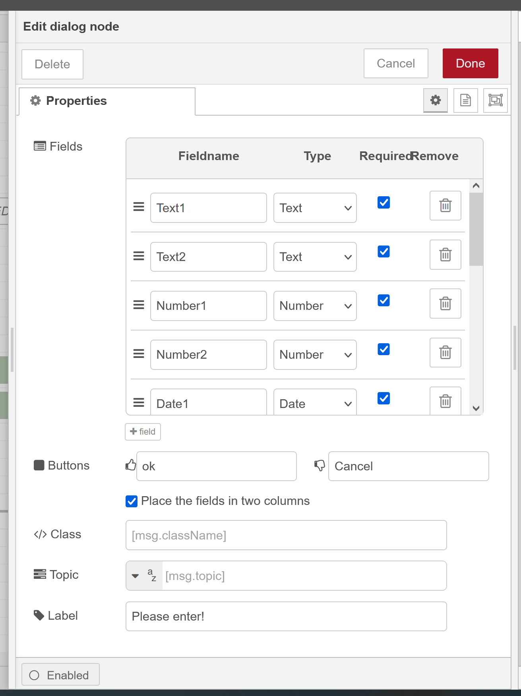
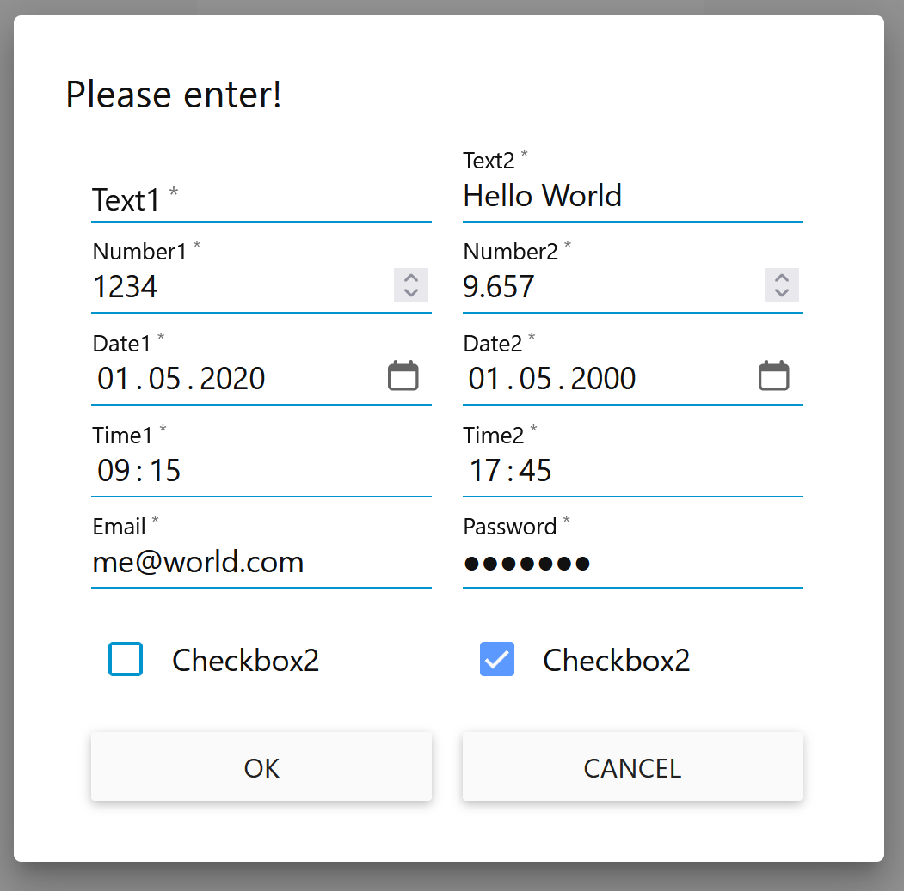

# Node-RED-Dashboard Input Dialog Popup

## Overview

To create an input popup dialog  with several fields of types like:  `text`, `number`, `date`, `time`, `checkbox`, `email` and `password`  placed in one or two rows

The fields could be marked as `required`, which leads to validation checks before the popup dialog is closed.

The enhancements for the Input Dialog Popup are devided into enhancements of the node-red-dashboard main.js file and an own node named: 
[node-red-contrib-multi-input-dialog](https://github.com/Mannheim68199/node-red-contrib-multi-input-dialog/tree/dialog) ( branch: dialog )

The  `Dialog Setup`  and the resulting   `Dialog Popup`   looks like:

|                     |                     |
|------------|-------------| 

## Changes

* src/main.js
* Dialog.md
* dist/js/app.min.js
* src/DialogSetup.png
* src/DialogPopup.png
* partials/dialog.html (not used currently)

## Setup

To test the new node you have to replace the `app.min.js` file in your `node-red-dashboard dist/js` folder with the app.min.js file of this project 
and install the new dialog node with `git clone https://github.com/Mannheim68199/node-red-contrib-multi-input-dialog.git`
